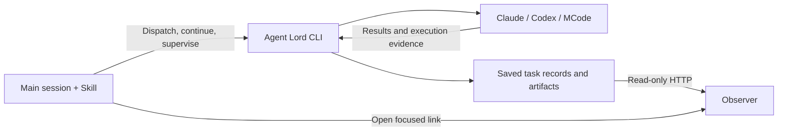

# Agent Lord

**English** | [简体中文](README.zh-CN.md)

Dispatch, follow, and continue coding agent tasks from one conversation.

Agent Lord lets your main Codex Desktop session delegate work to **Claude Code, Codex CLI, MCode CLI, or another Codex App task**. It saves each task's session, execution settings, and results so you can follow the work and continue the same task in a later turn.

It combines an **Agent Skill** for the caller, a **CLI runtime** for task execution and supervision, and a **read-only Observer** for viewing progress.

## See it in use

Ask for two independent reviews:

> Use Agent Lord to have Claude Code and Codex CLI independently review the current branch against main. Keep the source unchanged and summarize both reviews with file and line references.

The main session dispatches the reviews into separate worktrees, follows both tasks, and collects their results. You can then ask it to continue one of the saved review sessions with a follow-up question.


_Observer with synthetic example data. The current interface uses Chinese labels._

## What it handles

- **Continue saved sessions.** Follow-up turns use the task's existing endpoint and saved execution contract.
- **Supervise running work.** Checkpoints watch selected tasks for completion, actionable errors, and provider-specific recovery opportunities.
- **Coordinate independent tasks.** The main session controls dependencies and dispatch order; concurrent CLI tasks use separate worktrees with workspace and branch leases.
- **Keep pending instructions.** A passive request inbox records work that cannot run yet. The caller explicitly dispatches it when ready.
- **Inspect execution evidence.** The Observer shows requests, tool activity, results, and available model evidence. Missing evidence stays unknown.
- **Check declared deliverables.** Verify that requested files exist and are non-empty, or that a new commit exists with a clean worktree. Content correctness and test results still need actual acceptance.

## Quick start

### 1. Install and build

Requires **Node.js 24+**, **pnpm 9.12.0**, **Git**, and an installed, authenticated CLI for each provider you want to use. Codex App tasks require the host tools available in Codex Desktop.

```sh
git clone https://github.com/coder-xieshijie/agent-lord.git
cd agent-lord
pnpm install --frozen-lockfile
pnpm build
```

This builds both the runtime and the Observer. When upgrading a Python installation, follow the [migration guide](references/python-to-typescript.md) before switching its live state directory.

### 2. Add the Skill to Codex

For a new installation, run this from the cloned repository root:

```sh
mkdir -p "$HOME/.agents/skills"
ln -s "$PWD" "$HOME/.agents/skills/agent-lord"
```

If that skill path already exists, use and rebuild its checkout instead of running the linking command again. Codex supports symlinked skill folders and detects changes automatically; restart it if the skill does not appear. See [Codex skill discovery](https://learn.chatgpt.com/docs/build-skills#where-codex-loads-local-skills).

**Execution permissions:** the Skill starts new CLI tasks with permission bypass enabled. Review-only and external-write limits remain task instructions; they do not make the provider process read-only. Read the [execution contract](references/protocol.md#execution-contract) before your first dispatch.

### 3. Run a task

Open the repository you want to work on in Codex Desktop and ask:

> Use Agent Lord to ask Codex CLI to explain how this repository is organized. Keep the repository unchanged and return a short summary.

The main session uses [SKILL.md](SKILL.md) to dispatch and supervise the task. Expect a task ID, an Observer link, and a final response with execution evidence. If the host cannot open the page, you can use the local link while supervision continues.

For a follow-up, ask the main session to continue that same task. It reuses the saved endpoint after the previous operation finishes.

Prefer shell commands? The [CLI walkthrough](references/cli-quickstart.md) takes you through creating a file, checking delivery, continuing the task, and opening the Observer.

## Supported execution endpoints

| Endpoint    | Provider ID  | Continuation      | Observer                       |
| ----------- | ------------ | ----------------- | ------------------------------ |
| Claude Code | `claude-cli` | Saved CLI session | Conversation and tool activity |
| Codex CLI   | `codex-cli`  | Saved CLI thread  | Conversation and tool activity |
| MCode CLI   | `mcode-cli`  | Saved CLI session | Conversation and tool activity |
| Codex App   | `codex-app`  | Saved host task   | Task state only                |

`codex` and `mcode` are aliases for `codex-cli` and `mcode-cli`. Defaults live in [config/providers.json](config/providers.json); explicit arguments override them when a task starts. Later turns keep the saved contract.

MCode uses `--model provider/model[#variant]` and has no separate effort flag. Model evidence also differs by provider: for example, Codex CLI can enforce a requested model through arguments without reporting an actual model. See the [protocol](references/protocol.md#execution-contract) for verification and recovery rules.

## How it works



The main session owns task decomposition, provider selection, and workflow progression. Each execution endpoint receives a concrete assignment. The runtime owns persistent records, contract validation, provider calls, and recovery; the Observer only reads and displays that state.

Execution CLIs may use native tools and subagents such as `task` / `Task` / `Agent` within their assigned scope, but must not invoke Agent Lord themselves or through a subagent. See [scheduling ownership](SKILL.md#scheduling-ownership) for the executor constraint and supervision rule.

Task state lives in `~/.codex/state/agent-lord`. Set `AGENT_LORD_STATE_DIR` to use another location, or `AGENT_LORD_PROVIDER_CONFIG` to select another provider configuration.

## Workflows and boundaries

The Skill includes a [cross-review workflow](references/pipelines/cross-review.md) and a [handoff workflow](references/pipelines/handoff.md). A handoff transfers a sanitized context packet into a new CLI session and records its lineage; it does not migrate a native session.

A task has one saved endpoint and at most one in-flight operation. Pending requests do not steer a running CLI, and registering a request does not start it. Recovery follows the provider's documented rules and bounded budgets.

The Observer is read-only. An execution marked `SUCCEEDED` and verified file or commit delivery are separate results. Neither establishes that the code works or that a review is complete.

macOS is the local validation platform. The CI configuration covers macOS and Linux with Node 24; Windows is not claimed as end-to-end validated.

## Documentation

| Guide                                                               | Contents                                                           |
| ------------------------------------------------------------------- | ------------------------------------------------------------------ |
| [Agent Skill](SKILL.md)                                             | Caller responsibilities, dispatch, supervision, and continuation   |
| [CLI walkthrough](references/cli-quickstart.md)                     | A complete task lifecycle from the terminal                        |
| [Runtime protocol](references/protocol.md)                          | Commands, state, execution contracts, request inbox, and recovery  |
| [Observer guide](observer/README.md)                                | Setup, task binding, UI behavior, and privacy boundaries (Chinese) |
| [Development guide](references/development.md)                      | Runtime structure, build, tests, and compatibility                 |
| [Python → TypeScript migration](references/python-to-typescript.md) | Cutover, rollback, and shared-state precautions                    |

When changing either README, update the other language in the same change.
