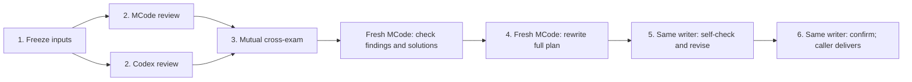

# Agent Lord

**English** | [简体中文](README.zh-CN.md)

**Coordinate coding agents from one conversation, with repeatable pipelines and verifiable delivery.**

Use your Codex Desktop, Codex CLI, Claude Code, or MCode session to delegate work to **Claude Code, Codex CLI, MCode CLI, or Codex App tasks**. Agent Lord keeps the execution contract, session identity, progress, and artifacts so the main session can supervise work and continue it later.

Start with a single task, or choose a built-in pipeline:

| You want to…                                 | Pipeline                                | What you get                                                              |
| -------------------------------------------- | --------------------------------------- | ------------------------------------------------------------------------- |
| Check a change from independent perspectives | [Cross-review](#cross-review)           | Source-backed findings, mutual challenges, and an independent final audit |
| Rewrite a complete plan after cross-review   | [Plan-cross-review](#plan-cross-review) | Four CLI roles, a standalone plan, and author coverage verification       |
| Turn an implementation plan into code        | [Plan-to-implement](#plan-to-implement) | Parallel module delivery, one integrator, and one PR/MR per repository    |

[Quick start](#quick-start) · [Observer](#observer) · [Execution endpoints](#execution-endpoints) · [Documentation](#documentation)

## How the pieces fit

Agent Lord combines a **Skill** that guides the main session, a **CLI runtime** that executes and records work, and an **Observer** that shows progress.


[Diagram sources and validation](assets/diagrams/README.md)

The main session owns the graph: roles, dependencies, dispatch, artifact exchange, and acceptance. The runtime freezes execution settings, manages worktrees and leases, saves records, and validates execution and declared delivery. Executors receive concrete assignments; they may use their native tools and subagents but must not invoke Agent Lord recursively.

Codex App tasks use the host's task tools and expose task state to the Observer. Local CLI tasks run through Agent Lord's runtime and expose conversation and tool activity. The diagrams use Chinese labels; each pipeline is described in English below. Interactive HTML viewers can be regenerated locally from the JSON sources — see the [diagram README](assets/diagrams/README.md); they are not committed to the repository.

## Pipelines

A pipeline defines **who does the work, what can run in parallel, which evidence unlocks the next stage, and when to stop**. The originating main session advances it using the shared runtime; the workflow is not delegated to another coordinator. The [common contract](references/pipelines/common.md) governs source identity, isolated workspaces, supervision, recovery, and artifact checks.

### Cross-review

Use this when you want reviewers to challenge each other's findings before an independent session checks the result.

> Use Agent Lord's cross-review pipeline to review the current branch against main. Keep the checkout and HEAD unchanged and return the verified findings with source locations.


[Full policy](references/pipelines/cross-review.md)

1. Pin one repository and the same head/base SHAs for every role. Run the MCode and Codex initial reviews concurrently in separate worktrees; neither sees the other's output.
2. Exchange their sanitized artifacts and run both cross-exams concurrently. Track agreement separately on evidence, severity, and the smallest complete fix.
3. If needed, run one additional convergence pair on unresolved items only. If disagreements remain, preserve them as `UNRESOLVED` and stop before the checker.
4. Once no items remain unresolved, start a **fresh MCode checker session**. It receives the source evidence and initial artifacts without consensus labels or final severity, and also inspects dropped candidates.

Defaults: MCode reviewer and checker use **Opus 5 / xhigh**; Codex uses **GPT-6 Astra / high**. The normal path has five planned provider operations, or seven with the optional convergence pair. Recovery does not add semantic review rounds.

The result separates **Pipeline Check** (whether the workflow and independent audit were verified) from **Review Result** (whether confirmed problems remain). A correctly completed pipeline can find bugs: `Pipeline Check: PASS`, `Review Result: FAIL`.

These pipelines depend on the separately installed `review-rules`, `plan-for-agents`, and `explain-as-fool` Skills from [dev-skills](https://github.com/coder-xieshijie/dev-skills). Complete the [dependency installation](#2-install-the-required-skills) before use; Agent Lord does not bundle or automatically install these rules.

### Plan-cross-review

Use this to replace an existing plan with a complete, self-contained implementation plan grounded in the spec and current source.

> Use Agent Lord's plan-cross-review pipeline on spec.md and plan.md against the latest target branch. Cross-review the findings, independently check the proposed solutions, then start a fresh MCode writer to rewrite the complete plan, self-check coverage, and confirm the exact final document.



[Full six-step policy](references/pipelines/plan-cross-review.md)

Exactly **four CLI roles**: two reviewers, a fresh independent checker, then a separate fresh writer. Reviewers/checker use the cross-review defaults above; the writer defaults to **MCode Opus 5 / xhigh**. Explicit role/model/effort choices override defaults. Later author turns reuse the writer session; there is no fifth final-plan auditor.

The writer receives the full original plan, spec, pinned source, review artifacts, checked solutions, and user decisions. It writes the final chosen design with all implementation context, then maps every requirement, valid old detail, and review disposition to the new text. There is **no line-count target** and no historical patch structure. Final confirmation binds the exact plan hash; delivery preserves those bytes and keeps any short summary separate.

The workflow delivers the plan and coverage audit, with bounded revisions and explicit unresolved items. It does not implement code or publish changes unless separately authorized. The checker audits review findings **before** writing; final document verification is the **writer's self-check**, not an independent final audit.

### Plan-to-implement

Use this when you already have an implementation plan and want module owners to work concurrently, followed by a single integration stage.

> Use Agent Lord's plan-to-implement pipeline to implement this plan. Split it into complete modules, run all dependency-ready modules in parallel, then integrate and verify the result. Open one PR per repository; do not merge it.


[Full policy](references/pipelines/plan-to-implement.md)

1. A **planner** produces a module plan from your implementation plan. Each module has ownership, acceptance criteria, non-overlapping write paths, and explicit dependencies. The runtime accepts only a plan delivered by a verified successful planner.
2. The main session dispatches **every ready module**, without a worker-count cap. Each worker uses its own worktree and branch, stays within its assigned paths, and commits locally. Verified upstream commits unlock dependent modules; the worker stage repeats as dependencies become ready.
3. After **all modules are delivered**, one distinct **integrator** merges the branches, resolves conflicts, fixes integration problems, runs project verification, and opens or updates one PR/MR per repository. Workers do not push or open their own PRs.
4. The runtime checks final branch heads, module history, structured verification records, and remote PR/MR identity. It persists the closing report before releasing workspace claims. Tests need actual evidence; user-accepted exceptions remain explicit.

By default, planner, workers, and integrator use MCode's resolved model and effort, currently **Opus 5 / xhigh**. You can override the provider globally or per role with Codex CLI or Claude Code. `plan-status` retains the ready set, barriers, and run journal across caller restarts; integration recovery preserves existing work and records. **The pipeline publishes PRs/MRs; it does not merge them.**

## Quick start

### 1. Install and build

Requires **Node.js 24+**, **pnpm 9.12.0**, **Git**, and an installed, authenticated CLI for each provider you want to use. Codex App tasks require the host tools available in Codex Desktop.

```sh
git clone https://github.com/coder-xieshijie/agent-lord.git
cd agent-lord
pnpm install --frozen-lockfile
pnpm build
```

This builds both the runtime and the Observer. When upgrading a Python installation, follow the [migration guide](references/python-to-typescript.md) before switching its live state directory.

### 2. Install the required Skills

Agent Lord and dev-skills are separate repositories. Agent Lord defines the workflow; dev-skills maintains the shared standards:

| Required Skill    | Used for                                        |
| ----------------- | ----------------------------------------------- |
| `review-rules`    | Reviews, cross-exams, and independent checking  |
| `plan-for-agents` | Plan content, revision, and completeness checks |
| `explain-as-fool` | Explanations and reports addressed to the user  |

Clone the full dev-skills repository and link its Skill directories into the shared installation directory. If you already have a checkout, set `dev_skills_dir` to that location instead of creating another maintenance source. The commands below preserve existing files, directories, and symlinks, including broken links.

```sh
# Use your existing dev-skills checkout here, if already installed.
dev_skills_dir="$HOME/code/github/skills/dev-skills"
if [ ! -e "$dev_skills_dir" ] && [ ! -L "$dev_skills_dir" ]; then
  mkdir -p "$(dirname "$dev_skills_dir")"
  git clone https://github.com/coder-xieshijie/dev-skills.git "$dev_skills_dir"
fi

(
  set -eu
  mkdir -p "$HOME/.agents/skills"
  for skill in review-rules plan-for-agents explain-as-fool; do
    source_dir="$dev_skills_dir/skills/$skill"
    entry="$HOME/.agents/skills/$skill"
    if [ ! -r "$source_dir/SKILL.md" ]; then
      printf 'Missing or unreadable source: %s\n' "$source_dir/SKILL.md" >&2
      exit 1
    fi
    if [ ! -e "$entry" ] && [ ! -L "$entry" ]; then
      ln -s "$source_dir" "$entry"
    fi
    ls -ld "$entry"
    if [ ! -r "$entry/SKILL.md" ]; then
      printf 'Missing or unreadable Skill: %s\n' "$entry/SKILL.md" >&2
      exit 1
    fi
  done
)
```

Inspect the printed entries: existing installations stay where they are and must point to the source you intend to maintain. If an entry is missing or unreadable, repair that installation before using the affected stage. Do not replace existing links blindly. Other hosts may register Skills differently; provide their actual readable paths. Every execution endpoint must be able to read the required Skill and its supporting references, including when it runs on another machine.

The scheduling caller passes resolved absolute paths in task prompts under the [dependency contract](SKILL.md#skill-dependencies); the runtime does not automatically load Skills. Missing dependencies stop the affected assignment with the missing Skill identified. There is no bundled fallback or automatic install/update. To update rules, fetch and inspect changes in the existing dev-skills checkout, fast-forward when safe, and run the affected Skill's self-check. Active runs retain their recorded rule version.

### 3. Add the Skill to Codex

For a new installation, run this from the cloned repository root:

```sh
mkdir -p "$HOME/.agents/skills"
ln -s "$PWD" "$HOME/.agents/skills/agent-lord"
```

If that skill path already exists, use and rebuild its checkout instead of running the linking command again. Codex supports symlinked skill folders and detects changes automatically; restart it if the skill does not appear. See [Codex skill discovery](https://learn.chatgpt.com/docs/build-skills#where-codex-loads-local-skills).

**Execution permissions:** the Skill starts new CLI tasks with permission bypass enabled. Review-only and external-write limits remain task instructions; they do not make the provider process read-only. Read the [execution contract](references/protocol.md#execution-contract) before your first dispatch.

### 4. Run a task

Open the repository you want to work on in Codex Desktop and ask:

> Use Agent Lord to ask Codex CLI to explain how this repository is organized. Keep the repository unchanged and return a short summary.

The main session uses [SKILL.md](SKILL.md) to dispatch and supervise the task. Expect a task ID, an Observer link, and a final response with execution evidence. If the host cannot open the page, you can use the local link while supervision continues.

For a follow-up, ask the main session to continue that same task. It reuses the saved endpoint after the previous operation finishes.

Prefer shell commands? The [CLI walkthrough](references/cli-quickstart.md) takes you through creating a file, checking delivery, continuing the task, and opening the Observer.

## Observer

The Observer shows task status, requests, tool activity, results, and available model evidence. It opens on a focused task or task set so you can follow concurrent work.


_Synthetic example data; the current interface uses Chinese labels._

It does not dispatch prompts or advance pipelines. At your explicit request, it can open an allow-listed saved CLI session in Orca or iTerm. This does not stop the original process; the provider may reject or queue a new prompt while busy. See the [Observer guide](observer/README.md).

## Execution endpoints

| Endpoint    | Provider ID  | Continuation      | Observer                       |
| ----------- | ------------ | ----------------- | ------------------------------ |
| Claude Code | `claude-cli` | Saved CLI session | Conversation and tool activity |
| Codex CLI   | `codex-cli`  | Saved CLI thread  | Conversation and tool activity |
| MCode CLI   | `mcode-cli`  | Saved CLI session | Conversation and tool activity |
| Codex App   | `codex-app`  | Saved host task   | Task state only                |

`codex` and `mcode` alias `codex-cli` and `mcode-cli`. Defaults live in [config/providers.json](config/providers.json). Explicit start arguments override defaults; subsequent turns keep the saved contract. Named pipelines may specify their own role defaults.

MCode requires version **0.4.9+**. `--model provider/model[#variant]` selects model identity; `--effort <level>` sets reasoning effort independently. Both are frozen across turns. Model evidence varies by provider; MCode effort is recorded as argument-enforced because its terminal stream does not report effort. See the [execution contract](references/protocol.md#execution-contract).

## Persistence and boundaries

- **Continue across turns.** Each task saves one endpoint and allows one in-flight operation. Durable controllers keep CLI execution alive after a dispatch command returns; checkpoints collect progress and handle supported recovery.
- **Resume supervision.** [Persistent task sets](references/supervision.md#persistent-task-sets) retain selected tasks and result acknowledgments. The [request inbox](references/scheduling-updates.md) retains deferred instructions; registering a request does not start or steer a running CLI.
- **Protect concurrent work.** Repo-managed concurrent CLI tasks use isolated worktrees and exclusive workspace/branch leases. Plan integration adds durable claims.
- **Distinguish execution from acceptance.** `SUCCEEDED`, verified file/commit delivery, test results, review findings, and publication are separate facts. Missing evidence stays unknown. Optional file preflight catches missing inputs before launch; it does not prove content correctness.

Task state defaults to `~/.codex/state/agent-lord`. Override it with `AGENT_LORD_STATE_DIR`; use `AGENT_LORD_PROVIDER_CONFIG` for another provider configuration. macOS is the local validation platform, CI is configured for macOS and Linux with Node 24, and Windows is not claimed as end-to-end validated.

## Documentation

| Guide                                                               | Contents                                                                       |
| ------------------------------------------------------------------- | ------------------------------------------------------------------------------ |
| [Agent Skill](SKILL.md)                                             | Caller responsibilities, dispatch, supervision, and continuation               |
| [CLI walkthrough](references/cli-quickstart.md)                     | A complete task lifecycle from the terminal                                    |
| [Pipeline contracts](references/pipelines/common.md)                | Shared execution and acceptance rules; individual policies linked above        |
| [Runtime protocol](references/protocol.md)                          | Result envelope, commands, state, execution contracts, and recovery            |
| [Supervision reference](references/supervision.md)                  | Persistent task sets, plan runs, workspace claims, and the request inbox       |
| [Provider transports](references/transports.md)                     | Codex CLI/App and MCode transport seams and configuration ownership            |
| [Observer guide](observer/README.md)                                | Setup, task binding, UI behavior, and privacy boundaries                       |
| [Development guide](references/development.md)                      | Runtime structure, build, tests, and compatibility                             |
| [Diagram sources](assets/diagrams/README.md)                        | Archify specifications, SVG exports, validation, and local viewer regeneration |
| [Python → TypeScript migration](references/python-to-typescript.md) | Cutover, rollback, and shared-state precautions                                |

When changing either README, update the other language in the same change.
