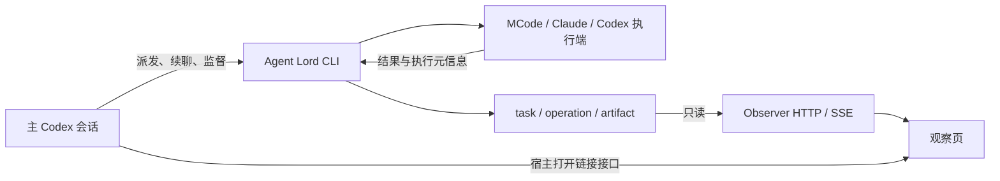

# Agent Lord

Deterministic orchestration for durable Claude CLI, Codex CLI, MCode CLI, and Codex App endpoints. The runtime and the read-only Observer are TypeScript packages in one pnpm workspace.

## Install and run

Requires Node.js **24+**, pnpm **9.12.0**, Git, and the selected provider CLI. Codex App uses its existing host-tool action/receipt protocol.

```sh
pnpm install --frozen-lockfile
pnpm --filter @agent-lord/core build
node core/dist/cli.js --help
node core/dist/cli.js start --task-id example --provider codex \
  --target /absolute/workspace --message-file /absolute/prompt.txt
node core/dist/cli.js turn --task-id example --message-file /absolute/next.txt
node core/dist/cli.js checkpoint --task-id example --seconds 120
```

`codex` and `mcode` remain aliases for `codex-cli` and `mcode-cli`. Defaults are Codex CLI `gpt-6-astra` / `xhigh`, Claude CLI `claude-fable-5` / `xhigh`, and MCode `custom_provider:mafia-claude/claude-fable-5#xhigh`. Explicit arguments override defaults; MCode accepts a qualified `--model provider/model[#variant]` and has no separate effort flag. `check` reads state; `checkpoint` also supervises orphaned CLI processes. A quiet checkpoint prints one compact JSON envelope and exits **124**. Provider execution success and declared delivery evidence remain separate fields.

The default state directory is `~/.codex/state/agent-lord`; set `AGENT_LORD_STATE_DIR` to use another directory. Provider profiles remain in `config/providers.json`, overridable with `AGENT_LORD_PROVIDER_CONFIG`. The compiled runtime resolves its default profile relative to the package, independently of the caller's working directory.

The task-record compatibility CLI is `node core/dist/task-store.js` with `put`, `get`, `upgrade`, and `remove`. Version 1 handles remain readable. Continuing one requires an explicit `upgrade` with model and effort; version 2 execution contracts stay frozen across later turns.

See [SKILL.md](SKILL.md) for orchestration policy, [the protocol](references/protocol.md) for envelopes and recovery, and [Observer](observer/README.md) for the read-only UI.

## Runtime structure

CLI 负责派发、监督和结果核验；观察器只读取执行记录并展示；宿主接口只负责打开链接。
Agent Lord 不使用或依赖 Computer Use / CUA，也不以浏览器自动化作为核验兜底。



`preview:attach` 经 HTTP 核验任务绑定，返回带 `task` 参数的页面链接；续聊沿用已有页面。
每轮请求保存独立的调用来源，详情展示请求模型、实际模型及核验来源；MCode 推理档位以 variant 显示。
时间线区分用户原话、实际派发请求与调度方补充请求。主调度状态只来自匹配 Session/Turn 的宿主事件，
缺失时显示未知。`checkpoint --include-response` 可将完整最终正文与执行证据一次返回，减少收尾往返。

| Component | Responsibility |
| --- | --- |
| `core/src/cli.ts`, `task-store.ts` | Public commands and compatibility interface |
| `core/src/engine.ts` | Durable dispatch, action receipts, finalization, checkpoint, and recovery |
| `core/src/state.ts`, `json.ts` | Atomic records, kernel-held leases, private permissions, lossless integer JSON |
| `core/src/workspace.ts` | Fixed source checks, worktree preparation, workspace/branch ownership, declared integration order |
| `core/src/providers/` | Provider-specific command construction and authoritative result validation |
| `core/src/process.ts`, `recovery-worker.ts` | Direct-file child I/O, process fencing, detached recovery controllers |
| `core/src/handoff.ts`, `artifacts.ts`, `delivery.ts` | Canonical handoff packets, sanitized final output, declared file/commit evidence |
| `core/src/contracts.ts` | Shared protocol types and identifier rules; safe for read-only consumers |
| `observer/` | Read-only state reader, provider stream projections, loopback HTTP/SSE, React UI |

Children write stdout/stderr directly to durable files. A controller's death does not close a pipe the provider depends on. Claude recovery uses a separate Node process and a controller lease; MCode requires a verified operation-bound stream, a durable exit receipt, and a fresh final file before success. Only verified transient MCode failures with stopped process groups can expose a bounded same-session continuation.

Kernel leases use the maintained native package [`fs-native-extensions`](https://github.com/holepunchto/fs-native-extensions), pinned in the lockfile. There is no timer-based stale-lock eviction, Python subprocess, or lock-file-existence fallback. Failure to load native locking prevents the controller from starting. Production launches use compiled JavaScript; `tsx` is only for development and tests.

## Python to TypeScript cutover

The migration preserves task-v2, operation-v1, action/event/artifact paths, provider identifiers, CLI flags, and handoff-v1 bytes/digests. Old JSON integer tokens such as `result_reset_at_ns` remain numeric on disk and are read/written losslessly with `bigint`. No state rewrite or new endpoint is required for compatible records.

1. Build the TypeScript checkout and validate it against an isolated `AGENT_LORD_STATE_DIR` using the fixtures. Keep the existing Python checkout available for rollback.
2. Stop new dispatches from the Python installation. Let its active operations finish, or use its existing recovery/decision flow to resolve them. Confirm both controllers and their provider process groups have exited; a terminal JSON status alone does not prove a process has stopped.
3. Back up the drained state directory. Switch callers/Skill links to this checkout and replace `python3 scripts/agent_lord.py` with `node /absolute/agent-lord/core/dist/cli.js` (and `scripts/task_store.py` with `node /absolute/agent-lord/core/dist/task-store.js`). Inspect existing tasks with `check`/`get`, then continue their saved endpoints with `turn`.
4. For rollback, stop new TypeScript dispatches and drain its controllers/providers first, then switch callers back to the saved Python checkout. Compatible current records can be inspected there; restoring a snapshot is appropriate only when it does not discard provider work performed since the snapshot.

Do **not** run Python and TypeScript writers against the same live state directory. On Linux the native library may use a different kernel lock namespace from Python's `flock`; same filenames do not provide cross-runtime exclusion. Tests exercise each runtime against isolated fixtures. After any ambiguous launch, resolve the existing operation; changing runtime is not authority to replay its prompt.

macOS is the local validation platform. CI runs the build and test suite on macOS and Linux with Node 24. Windows retains the existing conservative shared-lock behavior and process-tree code paths, but is not claimed as end-to-end validated by this migration.

## Development and validation

```sh
# Focused iteration:
pnpm --filter @agent-lord/core exec vitest run tests/engine.test.ts

# Final validation from the repository root:
pnpm build
pnpm typecheck
pnpm test
```

The suite uses standalone TypeScript fake providers, isolated state directories, real child processes, kernel locks, and temporary Git repositories. Reference fixtures in `core/tests/fixtures/*-reference.json` freeze 48 result-validation cases from Python main commit `1e71141af8c836c5f9594536bf63cd6502d819bf`, including exact structured errors and nanosecond comparisons. They run without Python. Integration cases cover frozen settings, retries, process death, duplicate recovery, workspace ownership, handoff replay, artifact binding, CLI envelopes, and legacy handle upgrades. They do not invoke paid providers or assert semantic completion from fake output.

Run `pnpm exec prettier --write 'core/**/*.ts'` to format core changes. Keep provider transcript parsing separate from the Observer's permissive display projections: visible output alone is not authoritative delivery evidence.
