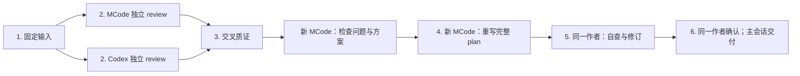

# Agent Lord

[English](README.md) | **简体中文**

**在一个主会话里协调 Coding Agent，用可重复的 pipeline 推进工作，用执行证据核验交付。**

在 Codex Desktop、Codex CLI、Claude Code 或 MCode 中，把工作交给 **Claude Code、Codex CLI、MCode CLI 或 Codex App 任务**。Agent Lord 保存执行契约、会话身份、进度和产物，让主会话能够持续监督，并在后续轮次继续同一个任务。

可以从单个任务开始，也可以直接选择内置 pipeline：

| 你想完成什么           | Pipeline                                       | 最终得到什么                             |
| ---------------------- | ---------------------------------------------- | ---------------------------------------- |
| 从独立视角审查一份改动 | [交叉审查](#交叉审查cross-review)              | 有源码证据的发现、双向质证和独立终审     |
| 交叉审查后重写完整方案 | [方案交叉审查](#方案交叉审查plan-cross-review) | 四个 CLI 角色、完整 plan、作者逐项自查   |
| 把已有实现计划落成代码 | [计划到实现](#计划到实现plan-to-implement)     | 模块并行交付、统一整合、每仓库一个 PR/MR |

[快速开始](#快速开始) · [Observer](#observer) · [支持的执行端](#支持的执行端) · [文档导航](#文档导航)

## 整体架构

Agent Lord 由三部分组成：指导主会话的 **Skill**、负责执行与记录的 **CLI Runtime**，以及展示进展的 **Observer**。


[图源与验证记录](assets/diagrams/README.md)

主会话负责整个流程：确定角色和依赖、派发任务、交换产物、判断是否通过验收。Runtime 负责冻结执行配置、管理 worktree 与租约、保存记录，并核验执行结果及声明的交付项。执行端接收具体任务，可以使用原生工具和子 agent，但不能递归调用 Agent Lord。

Codex App 任务由主会话通过宿主工具派发，Observer 展示其任务状态；本地 CLI 任务经由 Runtime 执行，Observer 还能展示对话和工具活动。架构与原有 pipeline 图由 Archify 生成，README 内嵌 SVG；新的 plan-cross-review 使用下方 Mermaid 流程图。交互版 HTML 可按[图源 README](assets/diagrams/README.md) 的步骤在本地重新生成，不随仓库分发。

## Pipelines

一条 pipeline 规定了**谁来做、哪些工作能并行、什么证据能放行下一步，以及何时结束**。原主会话通过共享 Runtime 推进流程，调度权始终留在主会话。[公共契约](references/pipelines/common.md)统一约束源码身份、工作区隔离、监督、恢复和产物核验。

### 交叉审查：Cross-review

适合需要两个执行端相互质证，并由独立会话再次核对结论的代码审查。

> 使用 Agent Lord 的 cross-review pipeline，审查当前分支相对 main 的改动。保持源码和 HEAD 不变，返回经过核验的问题及源码位置。


[完整规则](references/pipelines/cross-review.md)

1. 固定同一仓库的 head/base SHA。MCode 与 Codex 在各自 worktree 中**并发独立初审**，初审时互不接触对方的结果。
2. 交换脱敏后的产物，**并发互审**。分别核对每个问题的事实证据、严重程度，以及最小修复是否完整。
3. 必要时增加**最多一轮**收敛，仅处理仍有分歧的条目。若分歧仍未消除，保留为 `UNRESOLVED`，在独立复核前停止。
4. 没有未决项后，启动**全新的 MCode checker 会话**。它拿到源码证据和初审原文，但不接收共识标签或最终严重度，同时检查已被丢弃的问题是否漏判。

默认 MCode reviewer 与 checker 使用 **Opus 5 / xhigh**，Codex 使用 **GPT-6 Astra / high**。常规路径共五次计划内执行；增加收敛轮后共七次。运行时恢复不会增加语义上的审查轮次。

最终分开报告 **Pipeline Check**（流程与独立审计是否经过核验）和 **Review Result**（是否仍有已确认的问题）。流程有效但发现了 Bug 时，结果可以是 `Pipeline Check: PASS`、`Review Result: FAIL`。

这些 Pipeline 依赖 [dev-skills](https://github.com/coder-xieshijie/dev-skills) 中单独安装的 `review-rules`、`plan-for-agents` 和 `explain-as-fool`。使用前请先完成[依赖安装](#2-安装依赖-skill)；Agent Lord 不内置这些规则，也不会自动安装。

### 方案交叉审查：Plan-cross-review

适合以 spec 和当前源码为依据，把已有 plan 重写为一份可以单独指导实施的完整方案。

> 使用 Agent Lord 的 plan-cross-review pipeline，基于最新目标分支审查 spec.md 和 plan.md。交叉质证后独立检查问题与方案，再启动新的 MCode session 重写完整 plan，由作者自查完整性并确认最终文档。



[完整六步规则](references/pipelines/plan-cross-review.md)

固定 **四个 CLI 角色**：两个 reviewer、一个全新 session 的独立 checker，以及另一个全新 session 的 writer。前三者沿用上方 cross-review 默认值；writer 默认 **MCode Opus 5 / xhigh**。用户可以覆盖角色、模型与 effort。作者后续轮次复用写作 session，不增加第五个终稿审查 CLI。

作者接收原 plan 全文、spec、固定源码、全部 review、经过核验的方案与用户裁决，重写最终设计和完整实施上下文；随后逐项映射需求、原方案有效细节与 review 处理结论。**不设行数目标，不写历史补丁。** 最终确认绑定 plan 哈希，交付保持同一份文档，简短摘要单独提供。

交付完整 plan 和覆盖核对记录；修订轮次有上限，未解决问题明确保留。除非另有授权，不实施代码或发布改动。独立 checker 在写作前检查问题与方案；终稿采用**作者自查**，不声称经过独立终审。所有用户问题仍在原主会话提出。

### 计划到实现：Plan-to-implement

适合已经有实现计划，希望按模块并行开发，再由一个整合角色统一交付的任务。

> 使用 Agent Lord 的 plan-to-implement pipeline 实现这份计划。按完整模块拆分，把所有依赖就绪的模块并行派发，最后统一整合和验证。每个仓库开一个 PR，不合入。


[完整规则](references/pipelines/plan-to-implement.md)

1. **Planner** 将已有实现计划转为模块计划，明确职责、验收标准、互不重叠的写入路径与依赖。Runtime 只接纳由成功且已核验的 planner 交付的计划文件。
2. 主会话派发**全部 ready 模块，不设 worker 数量上限**。每个 worker 使用独立 worktree 和分支，只修改所属路径并在本地提交。经过核验的上游提交才会解锁下游模块；这一阶段随依赖满足分批推进。
3. **所有模块都交付后**，由一个独立的 **Integrator** 合并分支、解决冲突、修复整合问题、运行项目验证，并为每个仓库创建或更新一个 PR/MR。Worker 不自行推送或开 PR。
4. Runtime 核对最终分支 HEAD、模块整合历史、结构化验证记录和远端 PR/MR 身份，先保存最终报告，再释放工作区 claims。测试结论需要实际证据，用户接受的例外单独保留。

Planner、worker 和 integrator 默认使用 MCode 配置中解析出的模型与 effort，目前为 **Opus 5 / xhigh**；可以全局或按角色改用 Codex CLI、Claude Code。`plan-status` 将 ready 集合、屏障和过程日志保存在会话之外，主会话重启后可继续监督；整合恢复会保留已有工作和记录。**这条 pipeline 负责发布 PR/MR，不负责合入。**

## 快速开始

### 1. 安装并构建

需要 **Node.js 24+**、**pnpm 9.12.0**、**Git**，以及已安装并完成认证的目标 CLI。使用 Codex App 任务还需要 Codex Desktop 提供的宿主工具。

```sh
git clone https://github.com/coder-xieshijie/agent-lord.git
cd agent-lord
pnpm install --frozen-lockfile
pnpm build
```

这会同时构建运行时和 Observer。升级旧 Python 安装时，请先按[迁移指南](references/python-to-typescript.md)操作，再切换正在使用的状态目录。

### 2. 安装依赖 Skill

Agent Lord 和 dev-skills 是独立仓库。Agent Lord 定义流程，dev-skills 维护通用质量标准：

| 必需 Skill        | 用途                        |
| ----------------- | --------------------------- |
| `review-rules`    | 评审、交叉质证和独立检查    |
| `plan-for-agents` | Plan 内容、修订和完整性检查 |
| `explain-as-fool` | 面向用户的解释和报告        |

完整 clone dev-skills 仓库，再把其中的 Skill 目录软链接到共享安装目录。如果已有 checkout，将 `dev_skills_dir` 改为已有路径，保持唯一维护源。以下命令保留已有文件、目录和软链接，包括失效的软链接。

```sh
# 已安装时，将此变量改为已有 dev-skills checkout 的路径。
dev_skills_dir="$HOME/code/github/skills/dev-skills"
if [ ! -e "$dev_skills_dir" ] && [ ! -L "$dev_skills_dir" ]; then
  mkdir -p "$(dirname "$dev_skills_dir")"
  git clone https://github.com/coder-xieshijie/dev-skills.git "$dev_skills_dir"
fi

(
  set -eu
  mkdir -p "$HOME/.agents/skills"
  for skill in review-rules plan-for-agents explain-as-fool; do
    source_dir="$dev_skills_dir/skills/$skill"
    entry="$HOME/.agents/skills/$skill"
    if [ ! -r "$source_dir/SKILL.md" ]; then
      printf 'Missing or unreadable source: %s\n' "$source_dir/SKILL.md" >&2
      exit 1
    fi
    if [ ! -e "$entry" ] && [ ! -L "$entry" ]; then
      ln -s "$source_dir" "$entry"
    fi
    ls -ld "$entry"
    if [ ! -r "$entry/SKILL.md" ]; then
      printf 'Missing or unreadable Skill: %s\n' "$entry/SKILL.md" >&2
      exit 1
    fi
  done
)
```

检查命令打印的安装入口：已有安装保持原位，应指向你打算维护的来源。入口缺失或不可读时，先修复安装，再使用受影响的阶段，不要直接覆盖已有链接。其他宿主可以使用各自的 Skill 注册位置，但必须提供实际可读路径。每个执行端都需要能读取所需 Skill 及其引用文件，跨机器执行也不例外。

调度方按[依赖约定](SKILL.md#skill-dependencies)把解析后的绝对路径写入任务提示词，运行时不会自动加载 Skill。依赖缺失时说明具体 Skill，并停止受影响的任务；不会回退到仓库副本，也不会自动安装或更新。需要更新规则时，在已有 dev-skills checkout 中 fetch、检查变更、安全 fast-forward，并运行受影响 Skill 的自检。进行中的 run 保持原来记录的规则版本。

### 3. 将 Skill 接入 Codex

首次安装时，在刚克隆的仓库根目录执行：

```sh
mkdir -p "$HOME/.agents/skills"
ln -s "$PWD" "$HOME/.agents/skills/agent-lord"
```

如果该 Skill 路径已经存在，请使用并重新构建它所指向的仓库，不要重复执行创建链接的命令。Codex 支持软链接形式的 Skill 目录，会自动发现变更；如果 Skill 没有出现，重启 Codex。详见 [Codex Skill 发现规则](https://learn.chatgpt.com/docs/build-skills#where-codex-loads-local-skills)。

**执行权限：** Skill 会以跳过权限确认的模式启动新的 CLI 任务。“只做审查”和外部写入限制仍由任务指令约束，不会让执行进程变成只读。首次派发前，请阅读[执行契约](references/protocol.md#execution-contract)。

### 4. 发起一个任务

在 Codex Desktop 中打开你要处理的仓库，然后说：

> 使用 Agent Lord，让 Codex CLI 解释这个仓库的目录结构。保持仓库不变，返回一份简短说明。

主会话会按照 [SKILL.md](SKILL.md) 派发并监督任务。你会得到任务 ID、Observer 链接，以及包含执行证据的最终回复。如果宿主无法打开观察页，可以使用本机链接，监督流程会继续进行。

需要追问时，让主会话继续刚才的任务。上一轮操作结束后，它会沿用保存的执行端。

如果更喜欢直接使用命令行，可以阅读 [CLI 上手示例](references/cli-quickstart.md)，完整走通创建文件、核验交付、继续任务和打开 Observer 的流程。

## Observer

Observer 展示任务状态、请求、工具活动、结果和可用的模型证据。主会话可以打开聚焦到某个任务或任务集合的页面，便于查看并行工作的进展。


_截图使用合成的示例数据，当前界面使用中文标签。_

Observer 不派发 prompt，也不推进 pipeline。你显式要求时，它可以在 Orca 或 iTerm 中打开 allowlist 内保存的 CLI 会话。原执行进程会继续运行，执行端可能拒绝或排队处理忙碌期间的新 prompt。详见 [Observer 指南](observer/README.zh-CN.md)。

## 支持的执行端

| 执行端      | Provider ID  | 续聊方式        | Observer 展示  |
| ----------- | ------------ | --------------- | -------------- |
| Claude Code | `claude-cli` | 保存的 CLI 会话 | 对话与工具活动 |
| Codex CLI   | `codex-cli`  | 保存的 CLI 线程 | 对话与工具活动 |
| MCode CLI   | `mcode-cli`  | 保存的 CLI 会话 | 对话与工具活动 |
| Codex App   | `codex-app`  | 保存的宿主任务  | 仅任务状态     |

`codex` 和 `mcode` 分别是 `codex-cli` 和 `mcode-cli` 的别名。默认配置位于 [config/providers.json](config/providers.json)；创建任务时可用显式参数覆盖，后续轮次沿用保存的契约。命名 pipeline 可以定义自己的角色默认值。

MCode 要求 **0.4.9+**。`--model provider/model[#variant]` 选择模型身份，`--effort <level>` 独立设置思考强度，两者都在后续轮次保持冻结。不同执行端能提供的模型证据不同；MCode 终态流不回报 effort，因此 effort 记为启动参数已约束。详见[执行契约](references/protocol.md#execution-contract)。

## 持久化与能力边界

- **跨轮次继续。** 每个任务保存一个执行端，同一时刻最多有一个操作在执行。派发命令返回后，持久化控制器继续运行 CLI；checkpoint 收集进展并处理支持的恢复。
- **恢复监督。** [持久化任务集合](references/supervision.md#persistent-task-sets)保存选中的任务和结果确认状态。[请求收件箱](references/scheduling-updates.md)保存暂时不能执行的指令；登记请求不会启动任务，也不会向运行中的 CLI 插入指令。
- **保护并行工作。** 仓库管理模式下，并发 CLI 使用隔离 worktree 与独占工作区/分支租约。计划整合另有持久化 claims。
- **区分执行与验收。** `SUCCEEDED`、文件/提交交付已核验、测试结果、审查结论和发布状态是不同事实。缺失证据保持未知。可选的输入文件预检能在启动前发现材料缺失，但不能证明内容正确。

状态默认位于 `~/.codex/state/agent-lord`，可通过 `AGENT_LORD_STATE_DIR` 覆盖；其他执行端配置可用 `AGENT_LORD_PROVIDER_CONFIG` 指定。本地验证平台为 macOS；CI 配置覆盖 Node 24 下的 macOS 与 Linux，不宣称 Windows 已完成端到端验证。

## 文档导航

| 文档                                                           | 内容                                             |
| -------------------------------------------------------------- | ------------------------------------------------ |
| [Agent Skill](SKILL.md)                                        | 主会话职责、派发、监督与续聊                     |
| [CLI 上手示例](references/cli-quickstart.md)                   | 从命令行走通完整任务生命周期                     |
| [Pipeline 公共契约](references/pipelines/common.md)            | 共享执行和验收规则，各 pipeline 规则见上文       |
| [Runtime 协议](references/protocol.md)                         | 结果信封、命令、状态、执行契约与恢复             |
| [监督参考](references/supervision.md)                          | 持久化任务集合、plan run、工作区占用与请求收件箱 |
| [Provider 传输层](references/transports.md)                    | Codex CLI/App 与 MCode 的传输行为与配置归属      |
| [Observer 指南](observer/README.zh-CN.md)                      | 启动、任务绑定、界面行为与隐私边界               |
| [开发指南](references/development.md)                          | Runtime 结构、构建、测试与兼容性                 |
| [架构图源文件](assets/diagrams/README.md)                      | Archify JSON、SVG 导出、验证记录与本地再生成     |
| [Python → TypeScript 迁移](references/python-to-typescript.md) | 切换、回滚与共享状态注意事项                     |

修改任一语言的 README 时，请同步更新另一份。
