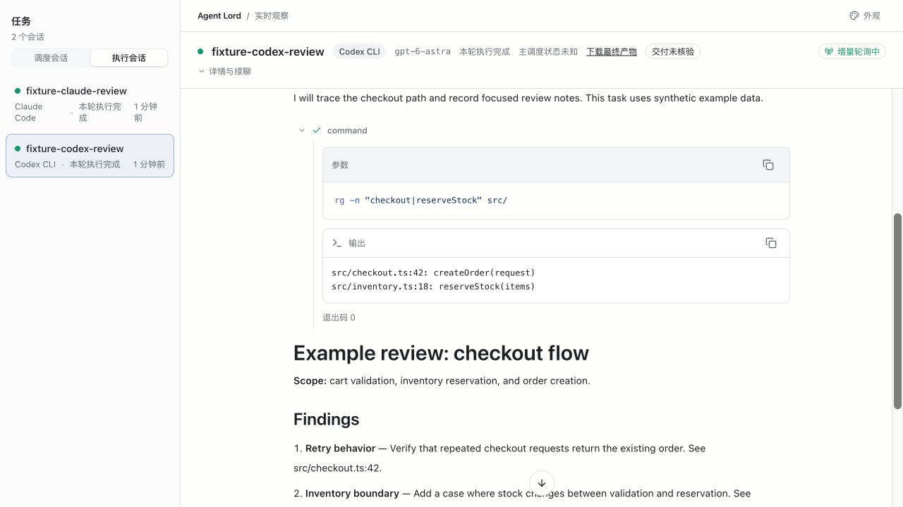
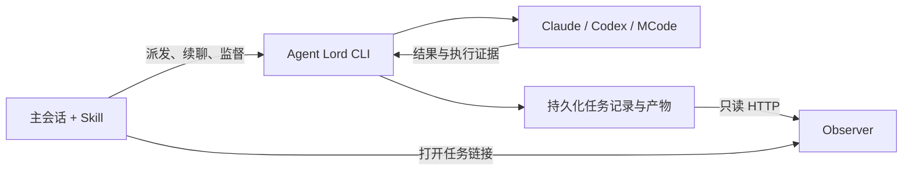

# Agent Lord

[English](README.md) | **简体中文**

在一个主会话中派发、跟踪和继续 Coding Agent 任务。

Agent Lord 让你的 Codex Desktop 主会话把工作交给 **Claude Code、Codex CLI、MCode CLI 或另一个 Codex App 任务**。它保存每个任务的会话、执行配置和结果，方便你查看进展，并在后续轮次继续同一个任务。

它由三部分组成：指导主会话的 **Agent Skill**、负责执行与监督的 **CLI 运行时**，以及展示进展的**只读 Observer**。

## 使用示例

让两个执行端独立审查同一份改动：

> 使用 Agent Lord，让 Claude Code 和 Codex CLI 分别独立审查当前分支相对 main 的改动。保持源码不变，汇总两份审查结论，并附上文件和行号。

主会话会把两个审查任务派发到各自的 worktree，跟踪进展并收集结果。之后，你还可以让它继续其中一个已有的审查会话，追问具体问题。



_Observer 截图使用合成的示例数据。当前界面使用中文标签。_

## 核心能力

- **继续已有会话。** 后续轮次沿用任务保存的执行端和执行契约。
- **监督运行中的工作。** Checkpoint 跟踪选定任务的完成状态、需要处理的错误，以及各执行端支持的恢复机会。
- **协调独立任务。** 主会话控制依赖和派发顺序；并发 CLI 任务使用独立 worktree，并受工作区和分支租约约束。
- **保存待处理指令。** 被动请求收件箱记录暂时无法执行的工作，由主会话在条件满足后显式派发。
- **查看执行证据。** Observer 展示请求、工具活动、结果和可用的模型证据；缺失的信息保持未知。
- **核验声明的交付项。** 检查指定文件是否存在且非空，或是否产生了新提交且工作区干净。内容正确性和测试结果仍需实际验收。

## 快速开始

### 1. 安装并构建

需要 **Node.js 24+**、**pnpm 9.12.0**、**Git**，以及已安装并完成认证的目标 CLI。使用 Codex App 任务还需要 Codex Desktop 提供的宿主工具。

```sh
git clone https://github.com/coder-xieshijie/agent-lord.git
cd agent-lord
pnpm install --frozen-lockfile
pnpm build
```

这会同时构建运行时和 Observer。升级旧 Python 安装时，请先按[迁移指南](references/python-to-typescript.md)操作，再切换正在使用的状态目录。

### 2. 将 Skill 接入 Codex

首次安装时，在刚克隆的仓库根目录执行：

```sh
mkdir -p "$HOME/.agents/skills"
ln -s "$PWD" "$HOME/.agents/skills/agent-lord"
```

如果该 Skill 路径已经存在，请使用并重新构建它所指向的仓库，不要重复执行创建链接的命令。Codex 支持软链接形式的 Skill 目录，会自动发现变更；如果 Skill 没有出现，重启 Codex。详见 [Codex Skill 发现规则](https://learn.chatgpt.com/docs/build-skills#where-codex-loads-local-skills)。

**执行权限：** Skill 会以跳过权限确认的模式启动新的 CLI 任务。“只做审查”和外部写入限制仍由任务指令约束，不会让执行进程变成只读。首次派发前，请阅读[执行契约](references/protocol.md#execution-contract)。

### 3. 发起一个任务

在 Codex Desktop 中打开你要处理的仓库，然后说：

> 使用 Agent Lord，让 Codex CLI 解释这个仓库的目录结构。保持仓库不变，返回一份简短说明。

主会话会按照 [SKILL.md](SKILL.md) 派发并监督任务。你会得到任务 ID、Observer 链接，以及包含执行证据的最终回复。如果宿主无法打开观察页，可以使用本机链接，监督流程会继续进行。

需要追问时，让主会话继续刚才的任务。上一轮操作结束后，它会沿用保存的执行端。

如果更喜欢直接使用命令行，可以阅读 [CLI 上手示例](references/cli-quickstart.md)，完整走通创建文件、核验交付、继续任务和打开 Observer 的流程。

## 支持的执行端

| 执行端      | Provider ID  | 续聊方式        | Observer 展示  |
| ----------- | ------------ | --------------- | -------------- |
| Claude Code | `claude-cli` | 保存的 CLI 会话 | 对话与工具活动 |
| Codex CLI   | `codex-cli`  | 保存的 CLI 线程 | 对话与工具活动 |
| MCode CLI   | `mcode-cli`  | 保存的 CLI 会话 | 对话与工具活动 |
| Codex App   | `codex-app`  | 保存的宿主任务  | 仅任务状态     |

`codex` 和 `mcode` 分别是 `codex-cli` 和 `mcode-cli` 的别名。默认配置位于 [config/providers.json](config/providers.json)；创建任务时可以通过显式参数覆盖，后续轮次沿用保存的契约。

MCode 使用 `--model provider/model[#variant]`，没有独立的 effort 参数。不同执行端提供的模型证据也不同，例如 Codex CLI 可以通过参数约束请求模型，却不一定回报实际模型。核验与恢复规则见[协议说明](references/protocol.md#execution-contract)。

## 工作原理



主会话负责任务拆解、执行端选择和流程推进，每个执行端接收具体的工作。运行时负责持久化记录、契约校验、执行端调用和恢复；Observer 只读取并展示这些状态。

执行 CLI 可以在已分配的任务范围内使用原生工具及子 agent（如 `task` / `Task` / `Agent`），但不得直接或通过子 agent 调用 Agent Lord。执行端约束与监督规则见 [Scheduling ownership](SKILL.md#scheduling-ownership)。

任务状态默认保存在 `~/.codex/state/agent-lord`。通过 `AGENT_LORD_STATE_DIR` 可以指定其他目录，通过 `AGENT_LORD_PROVIDER_CONFIG` 可以选择其他执行端配置。

## 工作流与能力边界

Skill 内置[交叉审查流程](references/pipelines/cross-review.md)和[交接流程](references/pipelines/handoff.md)。交接会把经过脱敏的上下文包传给一个新的 CLI 会话，并记录来源关系，不会迁移原生会话。

每个任务绑定一个保存的执行端，同一时间最多运行一个操作。待处理请求不会向运行中的 CLI 插入指令，登记请求也不会自动启动它。恢复遵循各执行端的明确规则和次数上限。

Observer 是只读的。执行状态 `SUCCEEDED` 与文件或提交的交付核验分别记录；两者都不能证明代码已经正确运行或审查已经充分完成。

本地验证平台为 macOS。CI 配置覆盖 Node 24 下的 macOS 和 Linux；Windows 尚未获得端到端验证。

## 文档导航

| 指南                                                           | 内容                                   |
| -------------------------------------------------------------- | -------------------------------------- |
| [Agent Skill](SKILL.md)                                        | 主会话职责、派发、监督和续聊           |
| [CLI 上手示例](references/cli-quickstart.md)                   | 从终端完成一个任务的完整生命周期       |
| [运行时协议](references/protocol.md)                           | 命令、状态、执行契约、请求收件箱和恢复 |
| [Observer 指南](observer/README.md)                            | 安装、任务绑定、界面行为和隐私边界     |
| [开发指南](references/development.md)                          | 运行时结构、构建、测试和兼容性         |
| [Python → TypeScript 迁移](references/python-to-typescript.md) | 切换、回滚和共享状态注意事项           |

修改任一 README 时，请在同一次改动中同步另一种语言。
